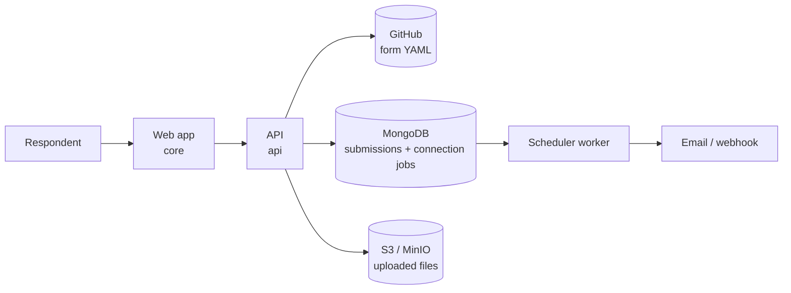

# Declarative Forms

**Forms that live in your Git repo.** Write a form as a YAML file, commit it to
GitHub, and it renders as a live, hosted form. No visual builder, no vendor
lock-in, no database of forms you cannot export. Your forms are files you own,
versioned like the rest of your work.

[](./LICENSE)
[](#self-hosting)

Use the public instance at **[frms.dev](https://frms.dev)**, or self-host the
whole stack with one `docker compose up`.

```yaml
# contact.yaml, committed to your GitHub repo
version: 1
title: "Contact us"
sections:
  - id: contact
    fields:
      - id: email
        type: email
        label: "Email address"
        validators: [required]
      - id: message
        type: long_text
        label: "How can we help?"
        validators: [required]
    next: done
```

Commit that file, then open `https://frms.dev/your-org/your-repo/contact`. That
is the whole workflow.

> **Using a coding agent?** Point it at **<https://frms.dev/AGENTS.md>** and it
> can write and maintain forms for you. No install, no plugin.
> <https://frms.dev/llms.txt> is the index, and
> <https://frms.dev/schema.json> is the machine-readable schema.

## Contents

- [Why Declarative Forms](#why-declarative-forms)
- [Quick start](#quick-start)
- [Validate your form](#validate-your-form)
- [Create forms with an AI agent](#create-forms-with-an-ai-agent)
- [For AI agents and LLMs](#for-ai-agents-and-llms)
- [How a URL maps to a form](#how-a-url-maps-to-a-form)
- [What you can build](#what-you-can-build)
- [Defining a form](#defining-a-form)
- [Where your data lives](#where-your-data-lives)
- [Architecture](#architecture)
- [Self-hosting](#self-hosting)
- [Local development](#local-development)
- [Contributing](#contributing)
- [License](#license)

## Why Declarative Forms

If you already like Tally, Jotform, or Youform, you know the strengths of a good
form builder. This is a different approach for people who would rather treat a
form like source code.

- **Your forms are files, not rows in someone's database.** A form is a YAML
  file in your repository. It is diffable, reviewable, and portable.
- **Version control, for real.** Every change is a commit. Review form edits in
  a pull request. Roll back a bad change with `git revert`. See who changed what
  and why.
- **Preview any branch before it ships.** Add `?branch=my-edit` to a form URL to
  render the version on that branch. Merge when it looks right.
- **Own your responses.** Submissions go to your MongoDB. Uploaded files go to
  your S3-compatible storage. Nothing is trapped in a service you cannot leave.
- **Open source and self-hostable.** Run the entire platform on your own
  infrastructure with one Docker Compose file. Licensed under AGPL-3.0.
- **Automate what humans should not do by hand.** Generate forms from scripts,
  keep them next to the code they collect data for, and template forms across
  repositories.

**The honest tradeoff.** There is no drag-and-drop editor. You write YAML. If
your team lives in Git and wants forms under the same review and history as
everything else, that tradeoff is the point. If you want a WYSIWYG canvas for
non-technical authors, a traditional builder may suit you better.

**Who it is for:** developers, technical teams, and anyone who wants their forms
to follow the same workflow as their code.

## Quick start

You need a GitHub repository and a form file. The public instance reads public
repositories. For private repositories, [self-host](#self-hosting) with a token.

**1. Add a form file to a GitHub repo.** Copy the [`contact.yaml`](./contact.yaml)
example, or start from the block at the top of this README. Commit it to any
public repo, for example at `forms/contact.yaml`.

**2. Open it.** Visit:

```
https://frms.dev/<owner>/<repo>/<path-to-file>
```

For a file at `forms/contact.yaml` in `your-org/your-repo`, that is:

```
https://frms.dev/your-org/your-repo/forms/contact
```

The `.yaml` extension is added for you, so leave it off the URL.

**3. Iterate.** Edit the YAML, commit, refresh. To preview work in progress
without touching your default branch, append `?branch=<branch-name>`.

Two example forms ship in this repo:
[`contact.yaml`](./contact.yaml) is a minimal starting point, and
[`kitchen-sink.yaml`](./kitchen-sink.yaml) exercises every feature.

## Validate your form

The complete schema is published as a JSON Schema at
**<https://frms.dev/schema.json>**. It is generated from the engine, so it
always describes exactly what this version of the product accepts.

Point your editor at it with a modeline on the first line of the file, and you
get inline errors and autocompletion for all 22 field types as you type:

```yaml
# yaml-language-server: $schema=https://frms.dev/schema.json
version: 1
title: "Contact us"
sections:
  - id: contact
    fields:
      - id: email
        type: email
        label: "Email address"
        validators:
          - required
```

That modeline is read by the VS Code YAML extension, Neovim, JetBrains IDEs, and
anything else built on `yaml-language-server`. To check a file in CI instead:

```bash
pip install check-jsonschema
check-jsonschema --schemafile https://frms.dev/schema.json forms/*.yaml
```

The schema is strict: it rejects unknown keys. A misspelled `min_lenght`, a
`searchable` on a field that is not a dropdown, or a stray `helpText` is caught
at authoring time rather than being silently ignored at render time. It is also
a good thing to hand an LLM or a coding agent, since it describes not just the
shape of a form but the behaviour behind it. For agents, pair it with
[AGENTS.md](https://frms.dev/AGENTS.md) and
[llms.txt](https://frms.dev/llms.txt).

## Create forms with an AI agent

Any coding agent can author forms here. There is nothing to install: point it at
the instructions and ask.

```text
Read https://frms.dev/AGENTS.md, then create a customer feedback form in
forms/customer-feedback.yaml. Make the rating required, comments optional,
and include a clear completion message.
```

[AGENTS.md](https://frms.dev/AGENTS.md) teaches an agent the complete schema, the behaviour
the schema cannot express, how to turn an objective into an effective form, and
how to update an existing form without breaking its IDs, logic, or stored
responses. It works with Claude Code, Codex, Cursor, and anything else that can
fetch a URL.

The agent writes the YAML locally, validates it against the published schema,
and tells you the URL it will render at. It does not need a hosted write API or
GitHub credentials, and it does not commit or push unless you ask. Review the
diff, commit the form, and the normal Declarative Forms URL renders it.

## For AI agents and LLMs

Three files are published for machine consumption. All are served with
`Access-Control-Allow-Origin: *`.

| File | What it is |
| --- | --- |
| **[llms.txt](https://frms.dev/llms.txt)** | Discovery index in [llmstxt.org](https://llmstxt.org) format. Start here. |
| **[AGENTS.md](https://frms.dev/AGENTS.md)** | Complete instructions for creating and updating forms. |
| **[schema.json](https://frms.dev/schema.json)** | The authoritative JSON Schema, generated from the engine. |

`AGENTS.md` and `llms.txt` are static assets in `packages/core/public/`, so
they ship with the web app like any other file. The build fails if a field type
is added to the engine without documenting it in `AGENTS.md`.

## How a URL maps to a form

```
https://frms.dev/your-org/your-repo/forms/signup?branch=draft&embed=true
                 └───────┘└───────┘└──────────┘  └──────────┘└─────────┘
                  owner     repo      file path      branch      options
```

| Part | Meaning |
| --- | --- |
| `owner` / `repo` | The GitHub repository the form is read from. |
| file path | Path to the YAML file inside the repo, without `.yaml`. |
| `?branch=` | Render the form from a specific branch. Defaults to `main`, not to the repository's own default branch. |
| `?embed=true` | Render for embedding in an `iframe`, without page chrome. |

Forms are read live from GitHub each time, so a commit is a deploy. Any other
query parameter [prefills a matching field](./SCHEMA.md#prefilling-fields-from-the-url),
which is handy for `hidden` fields and campaign links.

**If your default branch is not `main`,** pass it explicitly. The branch
defaults to the literal `main`, so a repository on `master` or `develop`
returns "not found" without `?branch=master`.

## What you can build

| Capability | Details |
| --- | --- |
| **22 field types** | Text, email, number, dates, single and multiple select, searchable dropdown, rating, file upload, camera capture, signature, address autocomplete, geolocation, hidden, and more. |
| **Validation** | Required, length, numeric and count bounds, regex patterns, and cross-field expressions with custom messages. |
| **Multi-step forms** | Split a form into sections with progress and per-section submission. |
| **Conditional logic** | Show or hide fields with `visible_when`. Branch between sections with conditional `next` rules. |
| **Templating** | Personalize titles and messages with `{{data.field_id}}` placeholders. |
| **Localization** | Provide any text as a per-language map. Switch with `?lang=`. |
| **Connections** | Queue immediate or delayed webhooks and emails, filtered by submission status and conditions. |
| **Partial submissions** | Answers are saved per section, so a refresh does not lose progress. |
| **Theming** | Set an accent color to match your brand. |
| **Analytics** | Optional Mixpanel and PostHog page-view and section-completion tracking. |
| **Embedding** | Drop a form into any page with an `iframe` using `?embed=true`. |

The complete, field-by-field reference is in **[SCHEMA.md](./SCHEMA.md)**.

## Defining a form

A form is one YAML file: a title, one or more `sections`, each with `fields`,
and an optional `completion` screen and `connections`. Here is a compact form
that uses sections, validation, conditional routing, and a webhook.

```yaml
version: 1
title: "Event signup"
description: "Reserve your seat."

sections:
  - id: attendee
    title: "About you"
    fields:
      - id: name
        type: short_text
        label: "Full name"
        validators: [required]
      - id: email
        type: email
        label: "Email"
        validators: [required]
      - id: ticket
        type: single_select
        label: "Ticket type"
        options: ["Standard", "VIP"]
        validators: [required]
    next:
      - when: "data.ticket === 'VIP'"
        go: vip
      - else: done

  - id: vip
    title: "VIP details"
    fields:
      - id: dietary
        type: long_text
        label: "Any dietary requirements?"
    next: done

completion:
  title: "You're in, {{data.name}}"
  message: "A confirmation is on its way to {{data.email}}."

connections:
  - type: webhook
    url: "https://example.com/hooks/signups"
```

For every key, field type, validator, and the expression language, read the
full **[schema reference](./SCHEMA.md)**.

## Where your data lives

Clarity on data matters, so here is exactly where everything goes when you
self-host.

- **Form definitions** are read live from GitHub on each request. GitHub remains
  the source of truth; an immutable snapshot is retained only inside a queued
  connection job so later form edits cannot change an existing delivery.
- **Submissions** are stored in your MongoDB, including partial (in-progress)
  responses.
- **Connection jobs** are stored in MongoDB until the scheduler delivers them.
- **Uploaded files** (uploads, camera photos, signatures) are stored in your
  S3-compatible bucket, served through your own domain.
- **No third-party form service** is involved. On the public frms.dev instance,
  the same applies to that instance's own storage.

## Architecture

The repository is an npm-workspaces monorepo with three packages.

| Package | What it is |
| --- | --- |
| `@declarativeforms/engine` | The shared library. Parses YAML and runs the `parse → resolve → compile → render` pipeline, plus all shared types. Framework-agnostic. |
| `@declarativeforms/core` | The web app. React 19, Next.js, Tailwind. Renders forms and handles submission. |
| `@declarativeforms/api` | The backend and scheduler worker. Fastify reads forms, stores submissions, and handles uploads; the separate worker delivers queued connections. |



When a form URL is opened, the API fetches the YAML from GitHub, the engine
turns it into a renderable form, and the web app renders it. Submissions flow
back through the API into your storage. The API queues a generic `submission`
job for each matching connection, and the scheduler delivers it at the
configured time. Connections default to completed submissions; see the
[connection schema](./SCHEMA.md#connections) for partial triggers and delayed
delivery.

## Self-hosting

Everything runs from one `compose.yaml`: Traefik terminates TLS, the web app and
API serve the forms, the scheduler delivers connections, and MongoDB and MinIO
hold your data. On a fresh Ubuntu host:

```bash
curl -fsSLO https://raw.githubusercontent.com/declarativeforms/core/main/.env.example
cp .env.example .env   # fill in DOMAIN, LETSENCRYPT_EMAIL and the passwords
curl -fsSLO https://raw.githubusercontent.com/declarativeforms/core/main/scripts/setup-digitalocean.sh
sudo bash setup-digitalocean.sh --env-file ./.env
```

Point `DOMAIN` at the host first, because Traefik gets its certificate over an
HTTP-01 challenge on first boot.

### Updates apply themselves

After that first run you do not redeploy to ship. When a new image is published
for the tag you deployed, the `updater` service pulls it and recreates `web`,
`api` and `scheduler`, waiting for each to report healthy before moving to the
next. It checks every `UPDATE_INTERVAL` seconds, 300 by default.

```bash
cd /opt/frms
docker compose logs -f updater        # watch it
docker compose stop updater           # pause it, until the next `up`
```

Set `UPDATE_INTERVAL=0` in `/opt/frms/.env` to park it durably. Both the
interval and `IMAGE_TAG` are re-read from that file on every pass, so neither
needs a restart to take effect.

`traefik`, `mongodb` and `minio` are **never** updated automatically. Their
versions are pinned in `compose.yaml` and move only when you re-run the setup
script.

### Pinning and rolling back

`IMAGE_TAG=latest` tracks the default branch. Every published commit also gets
an immutable `sha-` tag, and pinning one stops auto-update dead, because the
digest behind it never changes:

```bash
sudo ./scripts/setup-digitalocean.sh --tag sha-2e6a4c9
```

That is the way back from a bad release, and it holds until you deploy `latest`
again. Use the script rather than editing `.env` by hand, so the file and the
running containers agree.

### What auto-update does not cover

Only images. A change to `compose.yaml` itself, a new service or a new
environment variable, does not reach a running host: re-run the setup script to
adopt it. This is deliberate, because a stack definition that deployed itself
could change your pinned infrastructure or take the stack down against an `.env`
that has never heard of a newly required variable.

There is also no automatic rollback. If a published image fails to start,
`restart: unless-stopped` keeps retrying it and the updater logs that the
recreate never reported healthy; recovery is pinning a known-good `sha-` tag.

Expect roughly 30 to 50 seconds of disruption per update. The dominant cost is
that `packages/api/src/main.ts` installs no `SIGTERM` handler, so Node runs as
PID 1 without one and Docker waits the full 10 second grace period before
`SIGKILL` on each of `api` and `web`. Single-container Compose cannot do better
without a second replica.

If containers restart when no image was published, compare the config hashes the
host and the updater compute; they must be identical for `web`, `api` and
`scheduler`:

```bash
cd /opt/frms
docker compose config --hash '*'
docker compose exec updater \
  docker compose --project-directory /stack --env-file /stack/.env config --hash '*'
```

## Local development

You need Node.js 22 or newer. The engine builds first because both other
packages depend on it.

```bash
npm install
npm run build:engine

# Run the API (needs MongoDB and MinIO; start them with Docker Compose)
npm run dev:api

# In another terminal, deliver immediate and scheduled connections
npm run dev:scheduler

# Run the web app
npm run dev:core
```

The web app proxies `/api/*` to the backend, so point it at whichever API you
are running by putting `API_INTERNAL_ORIGIN` in `packages/core/.env.local`:

```bash
# packages/core/.env.local
API_INTERNAL_ORIGIN=http://127.0.0.1:8080
GOOGLE_MAPS_API_KEY=          # optional, enables address autocomplete
POSTHOG_PROJECT_KEY=          # optional, enables platform web analytics
POSTHOG_API_HOST=https://us.i.posthog.com
```

For direct Studio development, put the equivalent browser-visible values in
`packages/studio/.env.local` as `VITE_POSTHOG_PROJECT_KEY` and
`VITE_POSTHOG_API_HOST`. Docker Compose uses the unprefixed variables from the
root `.env` for both applications at container startup.

The browser always calls `/api/v1/...` on the same origin, so there is no CORS
hop in development either.

The API expects MongoDB and S3-compatible storage. The simplest way to provide
them during development is to run the stack with
`docker compose -f compose.yaml -f compose.local.yaml up --build`.

Useful scripts:

| Command | Description |
| --- | --- |
| `npm run build` | Build every package. |
| `npm run dev:core` | Start the web app in dev mode. |
| `npm run dev:api` | Start the API in watch mode. |
| `npm run dev:scheduler` | Start the connection scheduler in watch mode. |
| `npm test` | Run the API test suite. |

## Contributing

Contributions are welcome. Because forms are just YAML files, a great first
contribution is an example form or an improvement to the
[schema reference](./SCHEMA.md). For code changes, open an issue to discuss
larger work before sending a pull request.

## License

Declarative Forms is licensed under the **GNU Affero General Public License
v3.0**. You are free to use, modify, and self-host it. If you run a modified
version as a network service, the AGPL requires you to make your modified source
available to its users. See [LICENSE](./LICENSE) for the full text.
