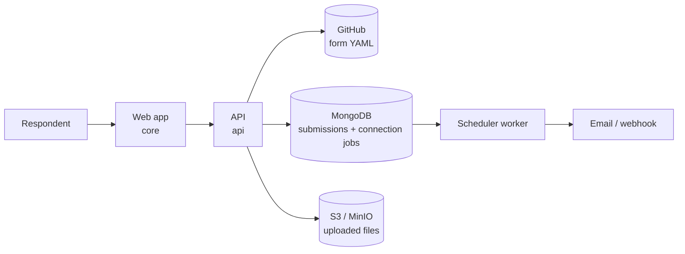

# Declarative Forms

**Forms that live in your Git repo.** Write a form as a YAML file, commit it to
GitHub, and it renders as a live, hosted form. No visual builder, no vendor
lock-in, no database of forms you cannot export. Your forms are files you own,
versioned like the rest of your work.

[](./LICENSE)
[](#self-hosting)

Use the public instance at **[frms.dev](https://frms.dev)**, or self-host the
whole stack with one `docker compose up`.

```yaml
# contact.yaml, committed to your GitHub repo
version: 1
title: "Contact us"
sections:
  - id: contact
    fields:
      - id: email
        type: email
        label: "Email address"
        validators: [required]
      - id: message
        type: long_text
        label: "How can we help?"
        validators: [required]
    next: done
```

Commit that file, then open `https://frms.dev/your-org/your-repo/contact`. That
is the whole workflow.

## Contents

- [Why Declarative Forms](#why-declarative-forms)
- [Quick start](#quick-start)
- [Create forms with an AI agent](#create-forms-with-an-ai-agent)
- [How a URL maps to a form](#how-a-url-maps-to-a-form)
- [What you can build](#what-you-can-build)
- [Defining a form](#defining-a-form)
- [Self-hosting](#self-hosting)
- [Where your data lives](#where-your-data-lives)
- [Architecture](#architecture)
- [Local development](#local-development)
- [Contributing](#contributing)
- [License](#license)

## Why Declarative Forms

If you already like Tally, Jotform, or Youform, you know the strengths of a good
form builder. This is a different approach for people who would rather treat a
form like source code.

- **Your forms are files, not rows in someone's database.** A form is a YAML
  file in your repository. It is diffable, reviewable, and portable.
- **Version control, for real.** Every change is a commit. Review form edits in
  a pull request. Roll back a bad change with `git revert`. See who changed what
  and why.
- **Preview any branch before it ships.** Add `?branch=my-edit` to a form URL to
  render the version on that branch. Merge when it looks right.
- **Own your responses.** Submissions go to your MongoDB. Uploaded files go to
  your S3-compatible storage. Nothing is trapped in a service you cannot leave.
- **Open source and self-hostable.** Run the entire platform on your own
  infrastructure with one Docker Compose file. Licensed under AGPL-3.0.
- **Automate what humans should not do by hand.** Generate forms from scripts,
  keep them next to the code they collect data for, and template forms across
  repositories.

**The honest tradeoff.** There is no drag-and-drop editor. You write YAML. If
your team lives in Git and wants forms under the same review and history as
everything else, that tradeoff is the point. If you want a WYSIWYG canvas for
non-technical authors, a traditional builder may suit you better.

**Who it is for:** developers, technical teams, and anyone who wants their forms
to follow the same workflow as their code.

## Quick start

You need a GitHub repository and a form file. The public instance reads public
repositories. For private repositories, [self-host](#self-hosting) with a token.

**1. Add a form file to a GitHub repo.** Copy the [`contact.yaml`](./contact.yaml)
example, or start from the block at the top of this README. Commit it to any
public repo, for example at `forms/contact.yaml`.

**2. Open it.** Visit:

```
https://frms.dev/<owner>/<repo>/<path-to-file>
```

For a file at `forms/contact.yaml` in `your-org/your-repo`, that is:

```
https://frms.dev/your-org/your-repo/forms/contact
```

The `.yaml` extension is added for you, so leave it off the URL.

**3. Iterate.** Edit the YAML, commit, refresh. To preview work in progress
without touching your default branch, append `?branch=<branch-name>`.

Two example forms ship in this repo:
[`contact.yaml`](./contact.yaml) is a minimal starting point, and
[`kitchen-sink.yaml`](./kitchen-sink.yaml) exercises every feature.

## Create forms with an AI agent

The repository ships a portable
[`create-declarative-form`](./skills/create-declarative-form) Agent Skill. It
teaches an agent the complete form schema, how the renderer behaves, how to
turn an objective into an effective form, and how to update an existing form
without breaking its IDs, logic, or integrations.

Install the skill into your agent's personal skill directory after cloning or
downloading this repository:

```bash
# Codex
mkdir -p ~/.codex/skills
cp -R skills/create-declarative-form ~/.codex/skills/

# Claude Code
mkdir -p ~/.claude/skills
cp -R skills/create-declarative-form ~/.claude/skills/
```

Then open the repository where the form should live and ask the agent, for
example:

```text
Use $create-declarative-form to create a concise customer feedback form in
forms/customer-feedback.yaml. Make the rating required, comments optional, and
include a clear completion message.
```

In Claude Code, invoke the same skill as `/create-declarative-form` followed by
the request.

The skill creates or updates the YAML locally, validates its structure and
respondent paths, and returns the prospective render URL. It does not need a
hosted write API or GitHub credentials, and it does not commit or push unless
you ask. Review the diff, commit the form to your repository, and the normal
Declarative Forms URL renders it.

## How a URL maps to a form

```
https://frms.dev/your-org/your-repo/forms/signup?branch=draft&embed=true
                 └───────┘└───────┘└──────────┘  └──────────┘└─────────┘
                  owner     repo      file path      branch      options
```

| Part | Meaning |
| --- | --- |
| `owner` / `repo` | The GitHub repository the form is read from. |
| file path | Path to the YAML file inside the repo, without `.yaml`. |
| `?branch=` | Render the form from a specific branch. Defaults to the repo's default branch. |
| `?embed=true` | Render for embedding in an `iframe`, without page chrome. |

Forms are read live from GitHub each time, so a commit is a deploy. Any other
query parameter [prefills a matching field](./SCHEMA.md#prefilling-fields-from-the-url),
which is handy for `hidden` fields and campaign links.

## What you can build

| Capability | Details |
| --- | --- |
| **22 field types** | Text, email, number, dates, single and multiple select, searchable dropdown, rating, file upload, camera capture, signature, address autocomplete, geolocation, hidden, and more. |
| **Validation** | Required, length, numeric and count bounds, regex patterns, and cross-field expressions with custom messages. |
| **Multi-step forms** | Split a form into sections with progress and per-section submission. |
| **Conditional logic** | Show or hide fields with `visible_when`. Branch between sections with conditional `next` rules. |
| **Templating** | Personalize titles and messages with `{{data.field_id}}` placeholders. |
| **Localization** | Provide any text as a per-language map. Switch with `?lang=`. |
| **Connections** | Queue immediate or delayed webhooks and emails, filtered by submission status and conditions. |
| **Partial submissions** | Answers are saved per section, so a refresh does not lose progress. |
| **Theming** | Set an accent color to match your brand. |
| **Analytics** | Optional Mixpanel and PostHog page-view and section-completion tracking. |
| **Embedding** | Drop a form into any page with an `iframe` using `?embed=true`. |

The complete, field-by-field reference is in **[SCHEMA.md](./SCHEMA.md)**.

## Defining a form

A form is one YAML file: a title, one or more `sections`, each with `fields`,
and an optional `completion` screen and `connections`. Here is a compact form
that uses sections, validation, conditional routing, and a webhook.

```yaml
version: 1
title: "Event signup"
description: "Reserve your seat."

sections:
  - id: attendee
    title: "About you"
    fields:
      - id: name
        type: short_text
        label: "Full name"
        validators: [required]
      - id: email
        type: email
        label: "Email"
        validators: [required]
      - id: ticket
        type: single_select
        label: "Ticket type"
        options: ["Standard", "VIP"]
        validators: [required]
    next:
      - when: "data.ticket === 'VIP'"
        go: vip
      - else: done

  - id: vip
    title: "VIP details"
    fields:
      - id: dietary
        type: long_text
        label: "Any dietary requirements?"
    next: done

completion:
  title: "You're in, {{data.name}}"
  message: "A confirmation is on its way to {{data.email}}."

connections:
  - type: webhook
    url: "https://example.com/hooks/signups"
```

For every key, field type, validator, and the expression language, read the
full **[schema reference](./SCHEMA.md)**.

## Self-hosting

Self-hosting gives you full data ownership and lets you read forms from private
repositories. The stack runs as one Docker Compose project: the web app, the
API, MongoDB for submissions, MinIO for file storage, and Traefik for automatic
HTTPS.

**Prerequisites:** a domain name pointed at the host. The automated setup below
installs Docker on a fresh Ubuntu Droplet; the manual setup requires Docker and
Docker Compose to be installed already.

### Automated DigitalOcean setup

For a fresh Ubuntu 24.04 LTS Droplet, download and run the production bootstrap
script after the domain's `A` record points to the Droplet:

```bash
curl --fail --remote-name \
  https://raw.githubusercontent.com/declarativeforms/core/main/scripts/setup-digitalocean.sh
chmod +x setup-digitalocean.sh
sudo ./setup-digitalocean.sh \
  --domain forms.example.com \
  --email admin@example.com
```

The script installs Docker from its official APT repository, creates a
non-root `deploy` user, hardens SSH, configures swap and bounded container logs,
and installs a persistent host firewall. The firewall covers both ordinary host
traffic and Docker-published ports, opening public HTTP and HTTPS while leaving
the VM's existing SSH firewall policy untouched. Docker publications other than
ports 80 and 443 are blocked on the public interface.

The script then generates production credentials, clones the selected public
Git revision, starts the stack, and waits for trusted HTTPS and API health
checks. Run `./setup-digitalocean.sh --help` for repository, ref, path, sizing,
firewall, optional integration-secret, and smoke-test parameters. No separate
firewall setup is required. DigitalOcean backups and monitoring remain optional
account-level settings. For deliberately proxied DNS, pass `--skip-dns-check`.

### Manual setup

```bash
git clone https://github.com/declarativeforms/core.git
cd core
cp .env.example .env
# Edit .env: set DOMAIN, LETSENCRYPT_EMAIL, and strong database and storage
# credentials. See the table below.
docker compose up -d
```

Traefik obtains a Let's Encrypt certificate for your `DOMAIN` automatically.
Once the services are healthy, your instance is live at `https://<DOMAIN>`.

### Configuration

Copy [`.env.example`](./.env.example) to `.env` and fill it in.

| Variable | Required | Purpose |
| --- | --- | --- |
| `DOMAIN` | Yes | Public hostname. Traefik issues TLS for it. |
| `LETSENCRYPT_EMAIL` | Yes | Address for Let's Encrypt certificate notices. |
| `MONGO_ROOT_USERNAME` / `MONGO_ROOT_PASSWORD` | Yes | MongoDB credentials. Use long, URL-safe values. |
| `MONGODB_DATABASE_NAME` | No | Database name. Defaults to `declarativeforms`. |
| `MINIO_ROOT_USER` / `MINIO_ROOT_PASSWORD` | Yes | Object storage credentials for file uploads. |
| `MINIO_BUCKET` | No | Bucket name. Defaults to `declarativeforms`. |
| `PUBLIC_BASE_URL` | No | Base URL used in returned file links. Derived from `DOMAIN` if empty. |
| `GITHUB_TOKEN` | No | Fine-grained PAT with read-only Contents access. Enables private repos. |
| `RESEND_API_KEY` / `RESEND_FROM_EMAIL` | No | Required only for email connections. |
| `VITE_GOOGLE_MAPS_API_KEY` | No | Enables Google Places address autocomplete. Without it, address fields fall back to manual entry. |

To read forms from a private repository, create a
[fine-grained personal access token](https://github.com/settings/tokens?type=beta)
with read-only **Contents** permission on that repository, and set it as
`GITHUB_TOKEN`. Grant no write permissions.

### Running locally without TLS

To try the full stack on your machine, layer the local override, which skips
Traefik and exposes the app on a port:

```bash
docker compose -f compose.yaml -f compose.local.yaml up --build
# Open http://localhost:8080
```

## Where your data lives

Clarity on data matters, so here is exactly where everything goes when you
self-host.

- **Form definitions** are read live from GitHub on each request. GitHub remains
  the source of truth; an immutable snapshot is retained only inside a queued
  connection job so later form edits cannot change an existing delivery.
- **Submissions** are stored in your MongoDB, including partial (in-progress)
  responses.
- **Connection jobs** are stored in MongoDB until the scheduler delivers them.
- **Uploaded files** (uploads, camera photos, signatures) are stored in your
  S3-compatible bucket, served through your own domain.
- **No third-party form service** is involved. On the public frms.dev instance,
  the same applies to that instance's own storage.

## Architecture

The repository is an npm-workspaces monorepo with three packages.

| Package | What it is |
| --- | --- |
| `@declarativeforms/engine` | The shared library. Parses YAML and runs the `parse → resolve → compile → render` pipeline, plus all shared types. Framework-agnostic. |
| `@declarativeforms/core` | The web app. React 19, Vite, Tailwind. Renders forms and handles submission. |
| `@declarativeforms/api` | The backend and scheduler worker. Fastify reads forms, stores submissions, and handles uploads; the separate worker delivers queued connections. |



When a form URL is opened, the API fetches the YAML from GitHub, the engine
turns it into a renderable form, and the web app renders it. Submissions flow
back through the API into your storage. The API queues a generic `submission`
job for each matching connection, and the scheduler delivers it at the
configured time. Connections default to completed submissions; see the
[connection schema](./SCHEMA.md#connections) for partial triggers and delayed
delivery.

## Local development

You need Node.js 22 or newer. The engine builds first because both other
packages depend on it.

```bash
npm install
npm run build:engine

# Run the API (needs MongoDB and MinIO; start them with Docker Compose)
npm run dev:api

# In another terminal, deliver immediate and scheduled connections
npm run dev:scheduler

# Run the web app
npm run dev:core
```

The API expects MongoDB and S3-compatible storage. The simplest way to provide
them during development is to run the stack with
`docker compose -f compose.yaml -f compose.local.yaml up`.

Useful scripts:

| Command | Description |
| --- | --- |
| `npm run build` | Build every package. |
| `npm run dev:core` | Start the web app in dev mode. |
| `npm run dev:api` | Start the API in watch mode. |
| `npm run dev:scheduler` | Start the connection scheduler in watch mode. |
| `npm test` | Run the API test suite. |

## Contributing

Contributions are welcome. Because forms are just YAML files, a great first
contribution is an example form or an improvement to the
[schema reference](./SCHEMA.md). For code changes, open an issue to discuss
larger work before sending a pull request.

## License

Declarative Forms is licensed under the **GNU Affero General Public License
v3.0**. You are free to use, modify, and self-host it. If you run a modified
version as a network service, the AGPL requires you to make your modified source
available to its users. See [LICENSE](./LICENSE) for the full text.
