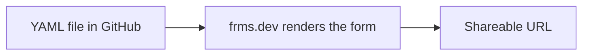

Define a form in a YAML file, push it to a GitHub repository, and Declarative Forms turns it into a live, shareable form. No account, no deployment, no visual editor — the YAML file is the form.

<Info>
**All you need is a GitHub repository.** Public or private — both work. There is nothing to install, sign up for, or deploy.
</Info>

## How it works



You create a `.yaml` file in a GitHub repository. Declarative Forms reads that file and renders it as an interactive form at a `frms.dev` URL. Every time you update the YAML and push to `main`, the form updates automatically.

---

## Create your form

<Steps>
  <Step title="Create a YAML file">
    In any GitHub repository, create a new `.yaml` file on the `main` branch. The filename becomes part of the form URL — for example, `contact.yaml` becomes `/contact`.
  </Step>

  <Step title="Define the form">
    Paste this complete contact form into your YAML file:

    ```yaml contact.yaml
    version: 1
    title: "Contact us"
    description: "Send us a message and we will get back to you."

    sections:
      - id: contact
        title: "Your details"
        fields:
          - id: full_name
            type: short_text
            label: "Full name"
            placeholder: "Jane Smith"
            validators:
              - required

          - id: email
            type: email
            label: "Email address"
            placeholder: "jane@example.com"
            validators:
              - required

          - id: message
            type: long_text
            label: "Message"
            placeholder: "How can we help?"
            validators:
              - required

        next: done

    connections:
      - type: email
        to: "hello@example.com"
        subject: "New contact form submission"
        include_responses: true
    ```

    Replace `hello@example.com` with the email address where you want to receive submissions.
  </Step>

  <Step title="Commit and push">
    Commit the file to the `main` branch and push. Your form is now live.
  </Step>
</Steps>

---

## Open your form

Once your YAML file is on `main`, open it through `frms.dev`. The process differs slightly depending on whether your repository is public or private.

<Tabs>
  <Tab title="Public repository">
    Navigate directly to:

    ```text
    https://frms.dev/<owner>/<repo>/<filename>
    ```

    | Placeholder    | Value                                         |
    |----------------|-----------------------------------------------|
    | `<owner>`      | Your GitHub username or organization           |
    | `<repo>`       | The repository name                            |
    | `<filename>`   | The YAML filename without `.yaml`              |

    **Example:** If your GitHub username is `acme` and you created `contact.yaml` in the `forms` repository:

    ```text
    https://frms.dev/acme/forms/contact
    ```

    The form loads immediately. No authentication required — anyone with the link can fill it in.
  </Tab>

  <Tab title="Private repository">
    Use the same URL format:

    ```text
    https://frms.dev/<owner>/<repo>/<filename>
    ```

    The first time you open this URL, Declarative Forms will redirect you to GitHub to authorize access. This is a standard OAuth flow — you grant Declarative Forms read access to the repository so it can fetch the YAML file.

    Once authorized, the form loads and works exactly like a public form. The authorization only happens once per repository.

    <Note>
    Anyone you share the form URL with will also need to authorize access on first load, since the repository is private. If you want the form to be accessible to anyone without authentication, use a public repository.
    </Note>
  </Tab>
</Tabs>

---

## Share your form

After you load the form for the first time, you'll be redirected to a permanent short URL like:

```text
https://frms.dev/c979ac5b
```

This is your form's **shareable link**. Share it with anyone who should fill in the form. It always points to the latest version of your YAML — every push to `main` updates the form automatically.

<Check>
**No redeploy needed.** Edit the YAML, push to `main`, and the form updates. There is no build step, deploy step, or cache to clear.
</Check>

---

## Verify it works

Open your form URL and run through these checks:

<Steps>
  <Step title="Form loads">
    The title, description, and all fields should appear.
  </Step>
  <Step title="Validation works">
    Submit with empty required fields — each one should show an error.
  </Step>
  <Step title="Submission succeeds">
    Fill in every field and submit. You should see the default completion screen.
  </Step>
  <Step title="Email arrives">
    Check the inbox you configured. A submission email with all responses should arrive within a few minutes.
  </Step>
</Steps>

---

## Troubleshooting

<AccordionGroup>
  <Accordion title="Form not loading">
    - Confirm the file is on the `main` branch.
    - Check that the URL matches the filename exactly (without `.yaml`).
    - For private repos, make sure you've completed the GitHub authorization.
  </Accordion>

  <Accordion title="YAML parse error">
    - Use **spaces**, not tabs. YAML is whitespace-sensitive.
    - Ensure all strings with special characters (`:`, `#`, `"`) are wrapped in quotes.
    - Validate your YAML with an online linter like [yamllint.com](https://www.yamllint.com).
  </Accordion>

  <Accordion title="No submission email received">
    - Confirm you replaced `hello@example.com` with your actual email address.
    - Check your spam or junk folder.
    - Verify the `connections` block is at the top level of the YAML (not nested inside a section).
  </Accordion>

  <Accordion title="Changes not showing up">
    - Make sure you pushed to the `main` branch, not a different branch.
    - Hard-refresh the form page (`Cmd+Shift+R` or `Ctrl+Shift+R`) to bypass browser cache.
  </Accordion>
</AccordionGroup>
