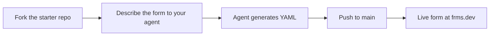

The [starter repository](https://github.com/declarativeforms/declarativeforms) is a ready-to-fork GitHub repository designed for AI coding agents. Fork it, describe the form you want in plain language, and the agent generates a complete YAML form definition. Push to `main` and your form is live at `frms.dev` — no manual authoring, no build step, no deployment.

<Info>
**All you need is a GitHub account and an AI coding agent.** The repository includes an agent instructions file that teaches the agent the full Declarative Forms schema, so it produces valid YAML without any setup on your part.
</Info>

## How it works



You fork the repository, open it in your AI coding agent, and describe the form you need. The agent reads the instructions file bundled in the repository and produces a `.yaml` file. Commit it to `main` and it is immediately available as a live form.

---

## Create a form with your agent

<Steps>
  <Step title="Fork the repository">
    Go to [github.com/declarativeforms/declarativeforms](https://github.com/declarativeforms/declarativeforms) and click **Fork** to create your own copy.

    Public repositories are immediately accessible at `frms.dev`. Private repositories are also supported — the form creator authorizes access once, and respondents use the form without any GitHub login.
  </Step>

  <Step title="Open it in your AI coding agent">
    Open your fork in your preferred AI coding agent. The agent will automatically read the instructions file in the repository root, which gives it everything it needs to understand the Declarative Forms schema.

    Supported agents include any tool that reads agent instructions from the repository root, such as:

    - [GitHub Copilot](https://github.com/features/copilot)
    - [Claude Code](https://claude.ai/code)
    - [OpenAI Codex CLI](https://github.com/openai/codex)
  </Step>

  <Step title="Describe the form you want">
    Tell the agent what you need in plain language. A good prompt includes:

    - **What the form is for** — registration, feedback, applications, lead capture, etc.
    - **Who will fill it out** — technical users, customers, job applicants, etc.
    - **What sections and fields you need** — or leave it to the agent to decide
    - **What should happen after submission** — confirmation email, internal notification, webhook, etc.

    The repository includes a `sample_prompt.md` you can use as a reference for the level of detail that works well.
  </Step>

  <Step title="Push to main and browse">
    Commit the generated YAML file to the `main` branch and push. Your form is immediately live at:

    ```text
    https://frms.dev/<owner>/<repo>/<filename>
    ```

    Use the YAML file's path relative to the repository root, without the `.yaml` extension. For example:

    - `contact.yaml` → `https://frms.dev/acme/declarativeforms/contact`
    - `templates/event-registration.yaml` → `https://frms.dev/acme/declarativeforms/templates/event-registration`
  </Step>
</Steps>

<Check>
**Every push to `main` updates the form instantly.** There is no build or deploy step. Edit the YAML, push, and the form is updated.
</Check>

---

## Templates

The starter repository includes ready-made templates you can use as a starting point or copy directly. Each template is a complete, valid YAML form.

| Template | YAML | Live preview |
|----------|------|--------------|
| Bug report | [YAML](https://github.com/declarativeforms/declarativeforms/blob/main/templates/bug-report.yaml) | [Live form](https://frms.dev/declarativeforms/declarativeforms/templates/bug-report) |
| Contact us | [YAML](https://github.com/declarativeforms/declarativeforms/blob/main/templates/contact.yaml) | [Live form](https://frms.dev/declarativeforms/declarativeforms/templates/contact) |
| Employee onboarding | [YAML](https://github.com/declarativeforms/declarativeforms/blob/main/templates/employee-onboarding.yaml) | [Live form](https://frms.dev/declarativeforms/declarativeforms/templates/employee-onboarding) |
| Event registration | [YAML](https://github.com/declarativeforms/declarativeforms/blob/main/templates/event-registration.yaml) | [Live form](https://frms.dev/declarativeforms/declarativeforms/templates/event-registration) |
| Feedback survey | [YAML](https://github.com/declarativeforms/declarativeforms/blob/main/templates/feedback-survey.yaml) | [Live form](https://frms.dev/declarativeforms/declarativeforms/templates/feedback-survey) |
| Job application | [YAML](https://github.com/declarativeforms/declarativeforms/blob/main/templates/job-application.yaml) | [Live form](https://frms.dev/declarativeforms/declarativeforms/templates/job-application) |
| Book a meeting | [YAML](https://github.com/declarativeforms/declarativeforms/blob/main/templates/meeting-booking.yaml) | [Live form](https://frms.dev/declarativeforms/declarativeforms/templates/meeting-booking) |
| Request a quote | [YAML](https://github.com/declarativeforms/declarativeforms/blob/main/templates/order-request.yaml) | [Live form](https://frms.dev/declarativeforms/declarativeforms/templates/order-request) |
| Support request | [YAML](https://github.com/declarativeforms/declarativeforms/blob/main/templates/support-request.yaml) | [Live form](https://frms.dev/declarativeforms/declarativeforms/templates/support-request) |
| Join the waitlist | [YAML](https://github.com/declarativeforms/declarativeforms/blob/main/templates/waitlist.yaml) | [Live form](https://frms.dev/declarativeforms/declarativeforms/templates/waitlist) |

---

## Tips for writing a good prompt

The better your prompt, the better the form your agent will produce. Here are patterns that work well:

| Do | Don't |
|----|-------|
| Specify the purpose and audience | Leave the agent guessing what the form is for |
| Name the sections and fields you need | Assume the agent knows your business context |
| State what should happen after submission | Forget to mention email or webhook connections |
| Mention specific field types when they matter (e.g., "email with OTP verification") | Over-specify every detail — let the agent handle formatting and layout |

<Tip>
**Start with the `sample_prompt.md` in the repository.** It shows a complete prompt for a two-section event registration form with OTP-verified email, UTM tracking, and post-submission notifications. Use it as a template for your own prompts.
</Tip>

---

## What the agent can generate

AI coding agents working with the starter repository can produce forms that use the full range of Declarative Forms capabilities:

- All [field types](/field-types/index) — text, email (with OTP), phone, number, date, dropdowns, file upload, address, signature, rating, and more
- [Multi-step flows](/examples/add-another-section) — split long forms into sections
- [Conditional logic](/examples/show-or-hide-a-field) — show or hide fields based on previous answers
- [Conditional navigation](/examples/add-conditional-navigation) — branch to different sections
- Validation — required fields, regex patterns, min/max values, custom expressions
- [Email connections](/examples/send-submissions-to-email) — send submissions to respondents or internal teams
- [Webhook connections](/examples/send-submissions-to-a-webhook) — post submissions to any URL
- [Custom completion screens](/examples/customize-the-thank-you-page) — personalized thank-you messages
- [Prefilling](/examples/prefill-data-using-query-parameters) — prepopulate fields from URL parameters
- [Localization](/examples/localize-a-form) — multi-language support
- UTM tracking — capture campaign attribution via hidden fields
- [Bot protection](/examples/protect-a-form-with-cloudflare-turnstile) — Cloudflare Turnstile CAPTCHA
